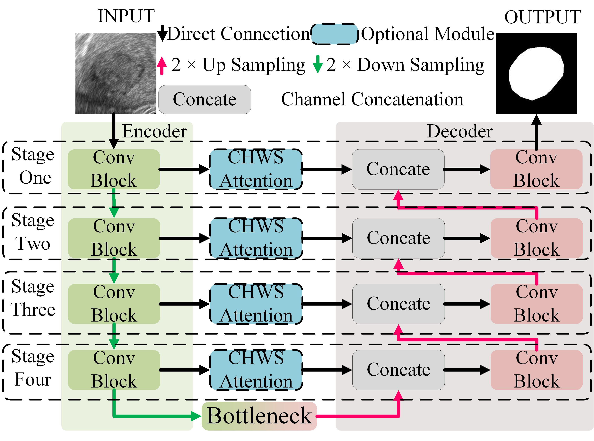

This is the official implementation of CHWS-UNet. The files ending with "_LCAM.py" and "_CHWS.py" indicate that the baseline models are improved by LCAM and CHWS module, respectively.   
The LCAM can be found in UNet_LCAM.py, coded as Channel Attention, otherwise can be seen below:
# LCAM 
class ChannelAttention(nn.Module):  
>    def __init__(self, in_planes, ratio=8, gamma=2, b=1, pattern=3):  
>>        super(ChannelAttention, self).__init__()  
>>        self.avg_pool = nn.AdaptiveAvgPool2d(1)  
>>        self.max_pool = nn.AdaptiveMaxPool2d(1)  
>>        self.in_planes = in_planes   
>>        kernel_size = int(abs((math.log(self.in_planes, 2) + b) / gamma))  
>>        kernel_size = np.max([kernel_size, 3])  
>>        kernel_size = kernel_size if kernel_size % 2 else kernel_size + 1  
>>        self.con1 = nn.Conv1d(1,1,kernel_size=kernel_size, padding=(kernel_size - 1) // 2, bias=False)  
>>        self.act1 = nn.Sigmoid()  
>>        self.pattern = pattern  

>    def forward(self, x):  
>>        if self.pattern == 0:  
>>           out1 = self.avg_pool(x) + self.max_pool(x)  
>>        elif self.pattern == 1:  
>>            out1 = self.avg_pool(x)  
>>        elif self.pattern == 2:  
>>            out1 = self.max_pool(x)  
>>        else:  
>>            output1 = self.avg_pool(x).squeeze(-1).transpose(-1, -2)  
>>            output1 = self.con1(output1).transpose(-1, -2).unsqueeze(-1)  
>>         output2 = self.max_pool(x).squeeze(-1).transpose(-1, -2)  
>>         output2 = self.con1(output2).transpose(-1, -2).unsqueeze(-1)  
>>         out1 = output1 + output2  
>>        if self.pattern != 3:  
>>            out1 = out1.squeeze(-1).transpose(-1, -2)  
>>            out1 = self.con1(out1).transpose(-1, -2).unsqueeze(-1)  

>>        output = self.act1(out1)  
>>        # output = self.act1(out1)  
>>        return output  

      
UNet_CHWS.py is the  implementationi of CHWS-UNet on basis of U-Net.  

#######UNet_CHWS.py#######  
#By default, four CHWS units are inserted into four shortcutpaths between the encoder and decoder as shortcut is set to [1, 1, 1, 1]("1" at position _i_ indicates the CHWS unit is inserted at _i_ th stage)  
for i in range(0, len(shortcut)):  
> if shortcut[i]:  
>> setattr(self, f"tp{i + 1}", CHWS(kernel_size=7, in_planes=[64*pow(2, i), 256//(pow(2, i)), 256//(pow(2, i))], mac_pattern=mac_pattern, mic_pattern=mic_pattern))  
